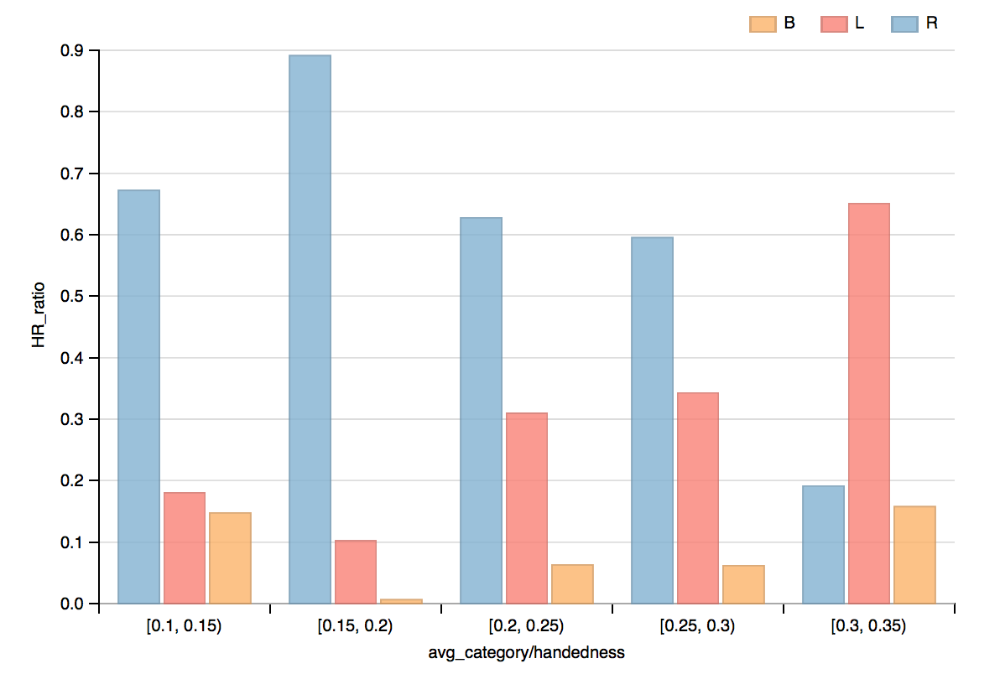

# Data Visualization: Baseball Data
by Yoon-gu Hwang, November 22, 2015

## Summary ##

This dataset about information of baseball players. 
It includes player's name, handedness (right, left handed, or both), height, weight, batting average, and the number of home runs.

## Design ##
### Exploratory Data Analysis using Python ###
I downloaded `baseball_data.csv` the dataset from data set options page given by Udacity. The dataset had player's physical information(`name`, `height`, `weight`) and performance information(`avg`, `HR`).

|      |      height |      weight |         avg |          HR|
|------|-------------|-------------|-------------|------------|
|count | 1157.000000 | 1157.000000 | 1157.000000 | 1157.000000|
|mean  |   72.756266 |  184.513397 |    0.186793 |   45.359551|
|std   |    2.142272 |   15.445995 |    0.106175 |   74.065110|
|min   |   65.000000 |  140.000000 |    0.000000 |    0.000000|
|25%   |   71.000000 |  175.000000 |    0.138000 |    1.000000|
|50%   |   73.000000 |  185.000000 |    0.238000 |   15.000000|
|75%   |   74.000000 |  195.000000 |    0.258000 |   55.000000|
|max   |   80.000000 |  245.000000 |    0.328000 |  563.000000|

There are 1157 players' records. Interestingly, some players have zero batting average or home runs, so I removed those rows.

|      |     height |     weight |        avg |         HR|
|------|------------|------------|------------|-----------|
|count | 871.000000 | 871.000000 | 871.000000 | 871.000000|
|mean  |  72.338691 | 182.846154 |   0.244201 |  60.253731|
|std   |   1.935478 |  14.971904 |   0.030703 |  79.940631|
|min   |  65.000000 | 140.000000 |   0.104000 |   1.000000|
|25%   |  71.000000 | 170.000000 |   0.232000 |  11.000000|
|50%   |  72.000000 | 180.000000 |   0.248000 |  27.000000|
|75%   |  74.000000 | 193.000000 |   0.263000 |  78.000000|
|max   |  80.000000 | 230.000000 |   0.328000 | 563.000000|

After cleaning meaningless rows, I had 871 records. Now I wanted to figure out player's performance with different handedness and avg_category. I showed histogram, HR vs. avg_category with 3 types of handedness. 
I used `pandas.cut` to split `avg` to 5 grades from 0.1 to 0.35.

|avg_category | handedness |    HR |
|-------------|------------|-------|
|[0.1, 0.15)  | B          |     9 |
|             | L          |    11 |
|             | R          |    41 |
|[0.15, 0.2)  | B          |     2 |
|             | L          |    32 |
|             | R          |   279 |
|[0.2, 0.25)  | B          |   904 |
|             | L          |  4449 |
|             | R          |  9020 |
|[0.25, 0.3)  | B          |  2268 |
|             | L          | 12591 |
|             | R          | 21861 |
|[0.3, 0.35)  | B          |   160 |
|             | L          |   660 |
|             | R          |   194 |

For unbalanced population, I needed to normalize values. So I added `HR_ratio` that is divided by subtotal `HR` sum for each handedness group.

|  avg_category | handedness |  HR  |   HR_partial sum | HR_ratio |
|---------------|------------|------|------------------|----------|
|  [0.1, 0.15)  |         B  |    9 |    61            | 0.147541 |
|  [0.1, 0.15)  |         L  |   11 |    61            | 0.180328 |
|  [0.1, 0.15)  |         R  |   41 |    61            | 0.672131 |
|  [0.15, 0.2)  |         B  |    2 |   313            | 0.006390 |
|  [0.15, 0.2)  |         L  |   32 |   313            | 0.102236 |
|  [0.15, 0.2)  |         R  |  279 |   313            | 0.891374 |
|  [0.2, 0.25)  |         B  |  904 | 14373            | 0.062896 |
|  [0.2, 0.25)  |         L  | 4449 | 14373            | 0.309539 |
|  [0.2, 0.25)  |         R  | 9020 | 14373            | 0.627566 |
|  [0.25, 0.3)  |         B  | 2268 | 36720            | 0.061765 |
|  [0.25, 0.3)  |         L  |12591 | 36720            | 0.342892 |
|  [0.25, 0.3)  |         R  |21861 | 36720            | 0.595343 |
|  [0.3, 0.35)  |         B  |  160 |  1014            | 0.157791 |
|  [0.3, 0.35)  |         L  |  660 |  1014            | 0.650888 |
|  [0.3, 0.35)  |         R  |  194 |  1014            | 0.191321 |

### Data Visualization using dimple.js ###
Here is my initial visualization graph. I chose `avg_category` for x-axis, and `HR_ratio` for y-axis. And I have 3 groups visualization, such as `R`, `L`,  and `B`

### Feedbacks ###